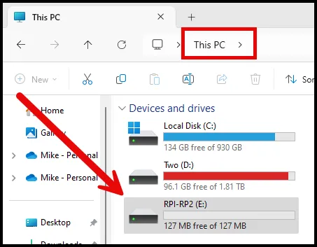

# DIY Rubber Ducky: Raspberry Pi Pico

## Background:

The USB Rubber Ducky is a versatile penetration testing tool disguised as a standard USB flash drive but operates as a keystroke injection device. Once plugged into a target system, it simulates a human typing at superhuman speeds, executing pre-written scripts to deliver payloads, run commands, or modify system settings without requiring special permissions. Because it acts as a USB keyboard, most systems recognize it instantly, allowing it to bypass many traditional security measures. It is widely used by ethical hackers for tasks such as gathering system information, exploiting vulnerabilities, and demonstrating potential security weaknesses in physical access defenses. The Rubber Ducky’s ease of use and effectiveness make it popular in both offensive security testing and educational settings. This walkthrough discusses making one with a Raspberry Pi Pico.

The Raspberry Pi Pico is a compact, low-cost microcontroller board built on Raspberry Pi’s custom RP2040 chip, aimed at hobbyists, students, and developers for a variety of electronics and programming projects. Unlike full Raspberry Pi boards, the Pico does not run a traditional operating system but instead relies on code uploaded directly to its memory, typically via MicroPython or C/C++. It features a dual-core ARM Cortex-M0+ processor, 264KB of RAM, and multiple GPIO (General Purpose Input/Output) pins for interfacing with sensors, LEDs, motors, and other electronics. The Pico is designed for power efficiency, ideal for projects needing precise timing and low-energy use, making it popular in robotics, IoT, and educational applications.

## Requirements:

1. Raspberry Pi Pico (Any version)

[Raspberry Pi Pico W : WiFi Wireless Bluetooth Single Board Computer](https://www.amazon.com/Raspberry-Pi-Pico-Wireless-Bluetooth/dp/B0B5H17CMK/ref=sr_1_5?crid=T8MCQR1BPFRK&dib=eyJ2IjoiMSJ9.6ZLsV73L7cwC59XetJcGRl0AwDi6wPxPEpdv-gz9axZvqKvGiI1rgS2ZQNVMIeUwxH5PuFd3Z8cTmXhdKyUJPs0d-T5b9NLZQhl-V26VwZMKynTjocIPC7TP_R2E-WUDv_wq-U1InhVlfydjUQtTeb4Zb-Xookg7DQKJJj9O24BlR-8dROILJesQwG0KU6mSPsfsk7U8jqPEEUVzBqMbpd2IKDXK0zTcbKPrFjra4TU.Uyosr-Qjr95UZ56nGtr1LtSiE5fKKhOgM1ogqNue80w&dib_tag=se&keywords=raspberry+pi+pico+w&qid=1721606835&sprefix=raspberry+pi+pico,aps,75&sr=8-5)

[Amazon Basics USB-A to Micro USB Fast Charging Cable, 480Mbps Transfer Speed with Gold-Plated Plugs, USB 2.0, 6 Foot, Black](https://www.amazon.com/gp/product/B07232M876/ref=ppx_yo_dt_b_search_asin_title?ie=UTF8&th=1)

Clone the repo below.

https://github.com/dbisu/pico-ducky

## Install Circuit Python

Press the **boot** button while connecting the raspberry pi pico to the computer.


1. After it is connected, **`RPI-RP2`** drive appears in This PC.



1. Open RPI-RP2


1. Download the **CircuitPython** firmware from this site https://circuitpython.org/board/raspberry_pi_pico/.


1. Copy the **uf2** file to the **RPI-RP2 (E:)** drive**.**


1. Wait for a second, and the device will reboot and appear with another name, **CIRCUITPY (E:)**.


## **Configure CircuitPython to be USB Rubber Ducky**

1. The next step is installing the Rubber Ducky converter in the Raspberry Pi Pico.
2. Go to [github.com/adafruit/Adafruit_CircuitPython_Bundle/releases](https://github.com/adafruit/Adafruit_CircuitPython_Bundle/releases) and download the latest **adafruit-circuitpython-bundle** file. Make sure that it is the 9.x one, since we are using 9.2.0 CircuitPython.


1. Unzip the downloaded file and go into its **lib** folder. Find the folder **adafruit_hid** and copy it. Go into your Raspberry Pi’s **lib** folder and paste it.


1. Copy `asyncio` , `adafruit_debouncer.mpy`  ,`adafruit_wsgi.mpy`and `adafruit_ticks.mpy` from **adafruit-circuitpython-bundle-9.x-mpy-20241108** lib folder. ****After completing, the lib file on the Pico should look similar to below.


1. Copy `duckyinpython.py`, `code.py`, `webapp.py`, `wsgiserver.py` to the root folder of the Pico.
2. Copy [boot.py](http://boot.py) from the pico-ducky-v2.0-us file to the root of the Pico.


1. Open payload.dd in notepad++ and type the payload below to ****demonstrate our DIY Rubber Ducky is working. Ensure you save payload.dd after completing it.

```python
DELAY 1000
GUI r
DELAY 500
STRING notepad
ENTER
DELAY 1000
STRING DIY Ducky Rocks!!!
```

Unplug the Raspberry Pi Pico and plug it back in. You should get the result seen below.


This payload is just a simple one for demonstration. If you want more info and examples of payloads go to the site below. 

https://github.com/hak5/usbrubberducky-payloads